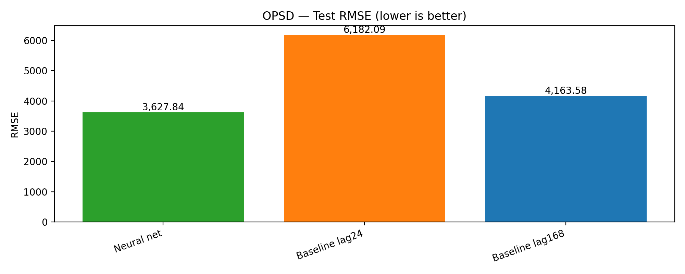

# Energy RNN Forecasting (PyTorch)

End-to-end time-series forecasting on [energy datasets](https://data.open-power-system-data.org/time_series/2020-10-06) using RNNs (LSTM/GRU) in **PyTorch** with:

- reproducible YAML configs
- strong seasonal baselines (lag-24, lag-168)
- residual learning over seasonal-naive (beats the weekly baseline on OPSD)
- a simple CLI (`check`, `train`, `eval`)
- run logging to `runs/<timestamp>_<dataset>/`

---

## 🏆 Key result (OPSD)

Residual LSTM (calendar + lags, residual over lag-168) beats seasonal-naive baselines on DE/LU load forecasting
(lookback=168 hours, horizon=24 hours).



---

## 🎯 What this repo does

### Current (implemented)

✅ **OPSD (Open Power System Data) time series** from SQLite  
✅ Feature engineering: **calendar features + lags**  
✅ Residual mode: **predict correction over lag-168**  
✅ Train + early stopping + best checkpoint saving  
✅ Evaluate + baselines (lag-24, lag-168)  
✅ Run logging: `results.yaml`, `results.md`, `config.yaml`, checkpoint copy  
✅ Notebooks: EDA, baselines, model diagnostics, results report

### Next (planned)

- UCI Electricity Load (download + pipeline)
- EIA-930 (download + pipeline)
- Hyperparameter sweeps + multi-run leaderboard

---

## 🗂️ Project structure

```text
energy-rnn-forecasting/
├── configs/
│   ├── opsd_lstm.yaml
│   ├── uci_gru.yaml              # placeholder (pipeline planned)
│   └── eia930_lstm.yaml           # placeholder (pipeline planned)
├── data/
│   ├── raw/
│   │   └── opsd_time_series/
│   │       └── time_series.sqlite
│   └── processed/                # optional (future: parquet/csv outputs)
├── notebooks/
│   ├── 01_opsd_eda_and_baselines.ipynb
│   ├── 02_opsd_model_diagnostics.ipynb
│   └── 03_opsd_results_report.ipynb
├── runs/
│   └── <timestamp>_opsd/
│       ├── config.yaml
│       ├── results.yaml
│       ├── results.md
│       ├── report_rmse_test.png   # created by notebook 03
│       └── report_table.md        # created by notebook 03
├── checkpoints/
│   └── opsd_best.pt
├── src/
│   ├── run.py                    # CLI entrypoint: check/train/eval (+ logging)
│   ├── train.py                  # training loop + early stopping
│   ├── evaluate.py               # prediction + metrics (supports residual recon)
│   ├── baselines.py              # lag-24 / lag-168 seasonal naive
│   ├── metrics.py                # RMSE / MAE / sMAPE
│   ├── models/
│   │   ├── lstm.py
│   │   └── gru.py
│   └── data/
│       ├── sqlite_opsd.py
│       ├── preprocess.py         # calendar + lags + imputation helpers
│       └── window_dataset.py     # sliding window dataset
├── requirements.txt
├── pyproject.toml
└── README.md
```

---

## 🛠️ Setup

1. Create a virtual environment

```bash
    python3 -m venv .venv
    source .venv/bin/activate
```

2. Install dependencies

```bash
    pip install -r requirements.txt
```

---

## 🗄️ Data (OPSD)

This repo currently expects the OPSD SQLite file at:

```text
    data/raw/opsd_time_series/time_series.sqlite
```

The config points to the hourly table:

- `time_series_60min_singleindex`

> Tip: The original DB is huge, keep only the 60-min table (hourly) for repo-friendly size.

---

## 🖥️ CLI usage

Validate config + dataset schema:

```bash
    python3 src/run.py check --config configs/opsd_lstm.yaml
```

Train end-to-end (logs into runs/):

```bash
    python3 src/run.py train --config configs/opsd_lstm.yaml
```

Train and choose where logs go:

```bash
    python3 src/run.py train --config configs/opsd_lstm.yaml --run-dir runs/demo_opsd
```

Evaluate an existing checkpoint (no retraining):

```bash
    python3 src/run.py eval --config configs/opsd_lstm.yaml --ckpt checkpoints/opsd_best.pt
```

---

## 📓 Notebooks

### 01 — OPSD EDA + Baselines

[notebooks/01_opsd_eda_and_baselines.ipynb](notebooks/01_opsd_eda_and_baselines.ipynb)

- target plots, seasonality, correlations, autocorr
- baseline metrics + example baseline forecast plot

### 02 — Model Diagnostics

[notebooks/02_opsd_model_diagnostics.ipynb](notebooks/02_opsd_model_diagnostics.ipynb)

- loads config + rebuilds pipeline
- loads best checkpoint
- forecast plots + error diagnostics + baseline comparison

### 03 — Results Report (README-ready)

[notebooks/03_opsd_results_report.ipynb](notebooks/03_opsd_results_report.ipynb)

- auto-loads latest runs/*/results.yaml
- saves:
- runs/`<latest>`/report_rmse_test.png
- runs/`<latest>`/report_table.md
- and can write a single repo-level summary:
- README_results.md

---

## ⚙️ Configuration (key ideas)

In `configs/opsd_lstm.yaml`:

- window.lookback: history length in hours (e.g., 168 = 7 days)
- window.horizon: forecast length (e.g., 24 = next day)
- preprocess.calendar_features: adds hour/day/week signals
- preprocess.lags: adds lag features (e.g., [24, 168])
- preprocess.target_mode: `residual_over_lag`:

trains the model to predict (`y - lag168`), then reconstructs `ŷ = lag168 + residual̂`.
